# Mindustry mod plugin

Plugin for building mindustry mods.

[My mod template based on this plugin](https://github.com/nekit508/mmp-template).

[GroovyDocs](docs%2Fjavadoc%2Findex.html).

---
# Local settings

`build.useAndroid` - whether .dex file be built (If you do not know what it means, set this parameter `false`)

`build.sdkRoot` - androidSDK root path (example D:/soft/android-sdk)

`copy` - list of paths where .jar file will be copied

---
# Projects info

Main project and it's initialized subproject contains reference to its plugin objects.
Every plugin object contains `settings` field, that stores it's project/subproject settings.

Below described all tasks, settings and most useful methods.

---
## Main project:

Plugin object: `nmp`

### Tasks:
- `nmpBuild` - build desktop jar
- `nmpDex` - build dex jar (will be skipped if `local.build.useAndroind`)
- `nmpBuildRelease` - build combined jar (desktop and android (if `local.build.useAndroind`))
- `nmpCopyBuildRelease` - build combined jar (desktop and android (if `local.build.useAndroind`)) and copy it in `local.copy`
- `nmpGenerateModInfo` - generate `mod.json` file (only if `nmp.generateModInfo`)

### Settings:
- `mindutsryVersion` - mindustry and arc version that will be used as dependencies (default `v146`)
- `modName` - name of mod, affects output .jar name and `mod.json`
- `modVersion` - name of mod, affects output .jar name, `mod.json` and `project.version`
- `modGroup` - group of mod, affects output .jar name and `project.group`
- `jabelVersion` - jabel version that will be used to compile mod (default `1.0.0`)
- `generateModInfo` - whether `mod.json` be generated (default `false`)
- `sourceCompatibility` - mod source bytecode version (allows newer features) (default 20th java version)

### Methods:
- `setupProjectAsAnnoProject(Project)` - initialize annotations subproject project
- `setupProjectAsToolsProject(Project)` - initialize tools subproject project

---
## Annotations subproject:

Plugin object: `nmpa`

### Tasks:
- `nmpaGenerateProcessorsFile` - generate `javax.annotation.processing.Processor` file

### Settings:
- `sourceCompatibility` - anno source bytecode version (allows newer features) (by default referenced to `jabelVersion` of main project)
- `jabelVersion` - jabel version that will be used to compile anno (by default referenced to `sourceCompatibility` of main project)

### Methods:

---
## Tools subproject:

Plugin object: `nmpt`

### Tasks
- `nmptRunTools` - runs specified main class of tools project,

### Settings:
- `sourceCompatibility` - tools source bytecode version (allows newer features) (by default referenced to `jabelVersion` of main project)
- `jabelVersion` - jabel version that will be used to compile tools (by default referenced to `sourceCompatibility` of main project)

### Methods:

---
## Tasks graph

_Arrow_ from **A** to **B** means that task **A** depends on task **B**.
_Dashed arrows_ means optional dependency 
(for example, task **A** will be performed without task **B** if it disabled by config).

Marks:
- cyan - added by plugin.
- yellow - default or added by another plugins

```mermaid
graph LR;
    classDef nmpTask fill:#193d40
    classDef defTask fill:#896300
    
    subgraph mainProject [Main project]
        direction TB
        nmpCopyBuildRelease-->nmpBuildRelease
        nmpBuildRelease-.->nmpDex
        nmpBuildRelease-->nmpBuild
        nmpDex-->nmpBuild
        nmpBuild-.->nmpGenerateModInfo
        nmpBuild-->mainProject:classes([classes])
    end
    
    subgraph annoProject [Anno project]
        direction TB
        annoProject:processResources([processResources])-->nmpaGenerateProcessorsFile
    end
    
    subgraph toolsProject [Tools project]
        direction TB
        nmptRunTools --> toolsProject:classes([classes])
    end
    
    class nmpCopyBuildRelease nmpTask
    class nmpBuildRelease nmpTask
    class nmpDex nmpTask
    class nmpBuild nmpTask
    class nmpGenerateModInfo nmpTask
    
    class nmpaGenerateProcessorsFile nmpTask
    
    class nmptRunTools nmpTask
        
    class mainProject:classes defTask
    class toolsProject:classes defTask
    class annoProject:processResources defTask
    
    mainProject ---> annoProject
```

