# Mindustry mod plugin

Plugin for building mindustry mods.

[My mod template based on this plugin](https://github.com/nekit508/mmp-template).

---
## Tasks info

### Main project:

`nmpBuild` - build desktop jar

`nmpDex` - build dex jar (will be skipped if `local.build.useAndroind`)

`nmpBuildRelease` - build combined jar (desktop and android (if `local.build.useAndroind`))

`nmpCopyBuildRelease` - build combined jar (desktop and android (if `local.build.useAndroind`)) and copy it in `local.copy`

`nmpGenerateModInfo` - generate `mod.json` file (only if `nmp.generateModInfo`)

### Annotations subproject:

`nmpaGenerateProcessorsFile` - generate `javax.annotation.processing.Processor` file

---
## Local settings

`build.useAndroid` - whether .dex file be built (If you do not know what it means, set this parameter `false`)

`build.sdkRoot` - androidSDK root path (example D:/soft/android-sdk)

`copy` - list of paths where .jar file will be copied

---
## Project settings

### Main settings

Plugin's main class contains settings (can be referenced from main project by `project.nmp.settings`) that allows you to manually set up the following parameters:
- `mindutsryVersion` - mindustry and arc version that will be used as dependencies (default `v146`)
- `modName` - name of mod, affects output .jar name and `mod.json`
- `modVersion` - name of mod, affects output .jar name, `mod.json` and `project.version`
- `modGroup` - group of mod, affects output .jar name and `project.group`
- `jabelVersion` - jabel version that will be used to compile mod (default `1.0.0`)
- `generateModInfo` - whether `mod.json` be generated (default `false`)
- `sourceCompatibility` - mod source bytecode version (allows newer features) (default 20th java version)

### Anno settings

Plugin's anno class contains settings (that can be referenced from anno subproject by `project.nmpa`) that allows you to manually set up the following parameters:
- `sourceCompatibility` - anno source bytecode version (allows newer features) (by default referenced to `jabelVersion` of main project)
- `jabelVersion` - jabel version that will be used to compile anno (by default referenced to `sourceCompatibility` of main project)

### Mod info generator

Task `tasks.nmpGenerateModInfo` supports all mod metadata fields and also allows you to add your own by storing it in `tasks.nmpGenerateModInfo.modMiscData`.

--- 
## Get project prepared

After setting up parameters, you can finally prepare your project for modding by using `nmp.genericInit()` method after parameters adjustment code.
This method will configure compilation settings, set up Jabel, create tasks and add midustry and arc dependencies.

Also, you can add annotation project by yourself and then configure it with `project.nmp.setupProjectAsAnnoProject(Project)`.
This method will create task for auto generate processors list and add annotations project as dependency to your main project.

---
## Tasks graph

_Arrow_ from **A** to **B** means that task **A** depends on task **B**.
_Dashed arrows_ means optional dependency 
(for example, task **A** will be performed without task **B** if it disabled by config).

Marks:
- `#193d40` - added by plugin.
- `#896300` - default or added by another plugins

```mermaid
graph LR;
    classDef nmpTask fill:#193d40
    classDef defTask fill:#896300
    
    subgraph mainProject [Main project]
        direction TB
        nmpCopyBuildRelease-->nmpBuildRelease
        nmpBuildRelease-.->nmpDex
        nmpBuildRelease-->nmpBuild
        nmpDex-->nmpBuild
        nmpBuild-.->nmpGenerateModInfo
        nmpBuild-->classes([classes])
    end
    
    subgraph annoProject [Anno project]
        direction TB
        processResources([processResources])-->nmpaGenerateProcessorsFile
    end
    
    class nmpCopyBuildRelease nmpTask
    class nmpBuildRelease nmpTask
    class nmpDex nmpTask
    class nmpBuild nmpTask
    class nmpGenerateModInfo nmpTask
    class nmpaGenerateProcessorsFile nmpTask
        
    class classes defTask
    class processResources defTask
    
    mainProject ---> annoProject
```

